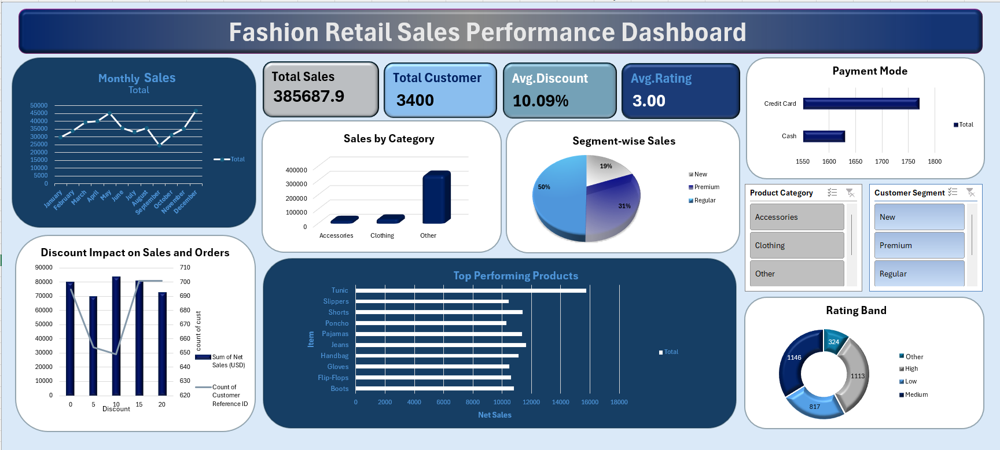

# Fashion Retail Sales Performance Dashboard
## Dashboard Preview

---

## Project Overview
This project is an interactive Excel dashboard designed to analyze Fashion Retail Sales Performance

---

## Key Metrics

- Total Sales: 385,687.9
- Total Customers: 3,400
- Average Discount: 10.09%
- Average Rating: 3.00

---

## Features

- Monthly Sales Analysis
- Category-wise Sales Analysis
- Segment-wise Sales Analysis
- Payment Mode Analysis
- Top Performing Products
- Interactive Slicers

---

## Tools Used

- Microsoft Excel
- Pivot Tables
- Pivot Charts
- Slicers
- Conditional Formatting

---

 ## Author
Nihana Nasri KK 
📧 Email: nihana789@gmail.com  
🔗 LinkedIn: https://www.linkedin.com/in/nihananasri-kk/
